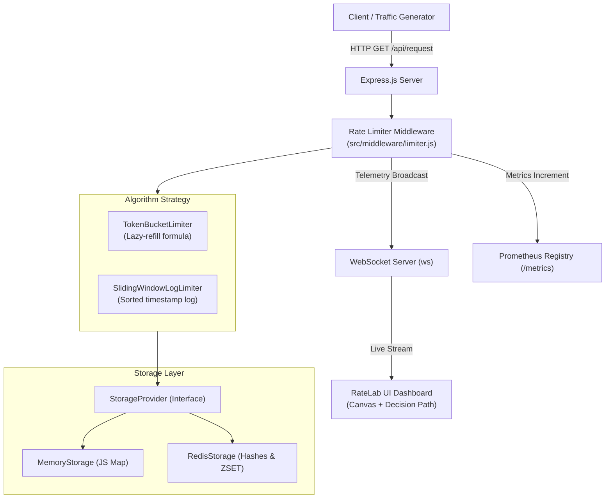

# 🚀 RateLab — Enterprise Rate Limiter Sandbox & Telemetry Platform

An enterprise-grade, developer-centric rate limiting engine and interactive telemetry platform built in **Node.js (ES Modules)**, **Express**, **ioredis**, **WebSockets (`ws`)**, and **Prometheus (`prom-client`)**. 

RateLab provides production-ready implementations of core traffic-shaping algorithms paired with a high-fidelity, glassmorphic dark-mode dashboard featuring an **HTML5 Canvas fluid physics visualizer**, **sliding-window timeline**, **real-time traffic generator**, **interactive decision-path visualizer**, **live telemetry streaming**, and **Prometheus metrics scraping**.

---

## 📑 Table of Contents

- [Key Features](#-key-features)
- [Architecture & Tech Stack](#-architecture--tech-stack)
- [Algorithms Implemented](#-algorithms-implemented)
  - [1. Token Bucket Algorithm](#1-token-bucket-algorithm)
  - [2. Sliding Window Log Algorithm](#2-sliding-window-log-algorithm)
  - [Algorithm Comparison](#algorithm-comparison)
- [Dual Storage Engines](#-dual-storage-engines)
  - [1. Local In-Memory Provider](#1-local-in-memory-provider)
  - [2. Distributed Redis Provider](#2-distributed-redis-provider)
- [Dashboard & Telemetry Features](#-dashboard--telemetry-features)
- [HTTP API Reference](#-http-api-reference)
- [Metrics & Observability](#-metrics--observability)
- [Installation & Quickstart](#-installation--quickstart)
- [Testing & Benchmarking](#-testing--benchmarking)
- [Project File Structure](#-project-file-structure)

---

## ✨ Key Features

### 🛡️ Core Rate Limiting
* **Dual Throttling Algorithms**: Switch dynamically at runtime between **Token Bucket** (lazy-refill) and **Sliding Window Log** (timestamp log).
* **Pluggable Storage Abstraction**: Seamlessly switch between zero-latency local in-memory storage and distributed Redis storage without restarting the server.
* **Standard RFC Response Headers**: Injects `X-RateLimit-Limit`, `X-RateLimit-Remaining`, `X-RateLimit-Reset`, and `Retry-After` (on `429 Too Many Requests`).
* **High-Precision Latency Tracking**: Microsecond-accurate validation profiling using Node.js `process.hrtime()`.

### 🖥️ Interactive RateLab UI Dashboard
* **Physical Glass Beaker & Token Canvas**: HTML5 Canvas fluid simulation showing bobbing plasma tokens, faucet replenishment droplets, and consumption discharge bubbles.
* **Sliding Window Timeline**: Real-time 10-second rolling visual track displaying timestamp ticks sliding and dissolving upon window expiration.
* **Live Decision Path Flow**: Interactive node diagram illustrating how client requests traverse the limiter logic to `200 OK` or `429 Blocked`.
* **Traffic Simulator**:
  * Single request manual trigger.
  * Instant 10-request burst test.
  * Automated traffic generator slider (1 to 20 req/sec) with live continuous firing.
* **Live Telemetry Stream**: Real-time table logging every request's timestamp, HTTP method, path, response status, latency (ms), remaining capacity, and active storage engine.
* **One-Click Telemetry Export**: Instant export of captured session telemetry logs to **CSV** or **JSON**.
* **Active Storage Key Inspector**: Live inspection table showing bucket tokens, last refill timestamps, and active sliding window logs in memory/Redis.
* **Global Reset**: One-click flush mechanism clearing state across all storage engines.

### 📊 Observability & Metrics
* **Prometheus Metrics Registry**: Native exposition format at `/metrics` tracking total requests, pass/block ratios, client tiers, and latency summaries.
* **Real-time WebSocket Hub**: Full-duplex broadcasting of limiter events and configuration changes to all active dashboards.

---

## 🛠️ Architecture & Tech Stack



* **Runtime**: Node.js (ES Modules)
* **Backend Framework**: Express.js
* **Distributed Database**: Redis via `ioredis` (Hashes & Sorted Sets)
* **Real-Time Streaming**: `ws` (WebSockets)
* **Metrics**: `prom-client` (Prometheus)
* **Frontend**: HTML5, Vanilla CSS3 (Custom Linear-inspired design tokens, Glassmorphism), HTML5 Canvas Physics Engine, WebSocket Client

---

## 🧮 Algorithms Implemented

### 1. Token Bucket Algorithm
Implemented in `src/algorithms/TokenBucketLimiter.js`.

- **Mechanism**: The bucket has a maximum capacity ($C$) and refills at a steady rate ($r$ tokens/second). Tokens are calculated on-demand using lazy replenishment:
  $$\text{tokens}_{\text{current}} = \min(C, \, \text{tokens}_{\text{prev}} + \Delta t \times r)$$
  $$\Delta t = \text{timestamp}_{\text{now}} - \text{timestamp}_{\text{lastRefill}}$$
- **Defaults**:
  - **Capacity**: `10 tokens`
  - **Refill Rate**: `1 token/second`
- **Behavior**: Permits short bursts of traffic up to the bucket capacity while maintaining a strict long-term average consumption rate.

### 2. Sliding Window Log Algorithm
Implemented in `src/algorithms/SlidingWindowLogLimiter.js`.

- **Mechanism**: Keeps a sorted timestamp log for each client request within a sliding time window ($W$). When a new request arrives:
  1. All timestamps older than $(\text{now} - W)$ are pruned.
  2. If the remaining count $< \text{Limit}$, the request is allowed and $\text{now}$ is added to the log.
  3. If count $\ge \text{Limit}$, the request is rejected with a `Retry-After` calculated from the oldest logged timestamp:
     $$\text{retryAfter} = \frac{(\text{timestamp}_{\text{oldest}} + W) - \text{now}}{1000}$$
- **Defaults**:
  - **Limit**: `10 requests`
  - **Window**: `10,000 ms` (10 seconds)
- **Behavior**: Completely eliminates boundary burst vulnerabilities and guarantees that the request rate never exceeds the threshold across any sliding window.

### Algorithm Comparison

| Attribute | Token Bucket | Sliding Window Log |
| :--- | :--- | :--- |
| **Primary Data Structure** | Hash: `{ tokens, lastRefillTime }` | Array / Redis Sorted Set (`ZSET`) |
| **Space Complexity** | $\mathcal{O}(1)$ constant memory per client | $\mathcal{O}(N)$ proportional to request volume |
| **Time Complexity** | $\mathcal{O}(1)$ simple arithmetic | $\mathcal{O}(\log N + M)$ pruning and inserting |
| **Burst Capacity** | Allows bursts up to bucket capacity | Enforces strict uniform limit across window |
| **Boundary Spike Risk** | None | None |

---

## 🗄️ Dual Storage Engines

### 1. Local In-Memory Provider
Implemented in `src/storage/MemoryStorage.js`.
* Backed by native JavaScript `Map` collections.
* Delivers ultra-low latency validation ($\sim 0.002\text{ ms}$).
* Ideal for single-instance applications, unit testing, and sandbox experimentation.

### 2. Distributed Redis Provider
Implemented in `src/storage/RedisStorage.js`.
* Backed by `ioredis` with support for secure cloud connections (`rediss://`, Upstash).
* **Token Bucket Storage**: Redis Hashes (`HSET rl:bucket:<key>`) with a 5-minute auto-expiry TTL.
* **Sliding Window Log Storage**: Redis Sorted Sets (`ZSET rl:sliding:<key>`) with pipelined atomic range pruning (`ZREMRANGEBYSCORE`, `ZRANGEBYSCORE`).
* **High Availability & Fault Tolerance**: Includes connection health reporting, exponential retry backoff, and non-blocking failure (`enableOfflineQueue: false`).

---

## 🖥️ Dashboard & Telemetry Features

The frontend interface (`public/index.html`, `public/styles.css`, `public/app.js`) is modeled after developer-grade observability tools with modern design aesthetics:

```
+---------------------------------------------------------------------------------------+
|  RateLab · Traffic Systems               [Redis: Offline/Online] [WS: Connected]      |
+---------------------------------------------------------------------------------------+
|  [Requests Sent: 10]  [Allowed 200: 10]  [Blocked 429: 0]  [Remaining Capacity: 0]    |
+-------------------------------------------+-------------------------------------------+
|  Interactive Visualizer                   |  Decision Path & Traffic Control          |
|  - Token Bucket (Canvas Plasma Physics)   |  - Real-time Interactive Node Graph       |
|  - Sliding Window (Timeline Ticks)        |  - Manual / Burst / Continuous Generator  |
+-------------------------------------------+-------------------------------------------+
|  Live Telemetry Stream                    |  Database Active Key Inspector            |
|  - Realtime request latency & status      |  - Live memory/redis key table            |
|  - [Export CSV] [Export JSON] [Clear]     |  - [Clear Storage Engine]                 |
+-------------------------------------------+-------------------------------------------+
```

1. **Physical Token Bucket Canvas**: Renders a glass container with bobbing plasma tokens, fill level indicators, top faucet refill droplets, and bottom drain bubble bursts.
2. **Dynamic Sliding Window Timeline**: Renders rolling request tick pills on a calibrated 0–10s timeline that slide in real-time and dissolve upon expiration.
3. **Decision Tree Node Graph**: Visualizes request evaluation from ingestion to pass/fail status with animated pulse highlights.
4. **Traffic Generator**: Test single requests, execute instant 10-request bursts, or dial in continuous traffic rates (1–20 req/s).
5. **Telemetry Logger & Exporter**: Displays rolling requests with HTTP status, latency, client ID, and storage mode. Export session logs to CSV or JSON with a single click.
6. **Key Inspector**: Monitor active keys, token counts, and sliding window logs stored across memory and Redis engines.

---

## 📡 HTTP API Reference

### 1. Execute Rate-Limited Request
Sends a test request through the rate limiter middleware.

* **Method / Path**: `GET /api/request`
* **Response Headers**:
  * `X-RateLimit-Limit`: Maximum allowable requests (`10`)
  * `X-RateLimit-Remaining`: Number of remaining requests permitted
  * `X-RateLimit-Reset`: Time in seconds until the bucket is completely refilled
  * `Retry-After`: (On HTTP 429) Required wait time in seconds before retrying
* **Success Response (`200 OK`)**:
  ```json
  {
    "success": true,
    "message": "API request completed successfully!",
    "timestamp": 1722521000000,
    "client": { "id": "127.0.0.1" }
  }
  ```
* **Blocked Response (`429 Too Many Requests`)**:
  ```json
  {
    "error": "Too Many Requests",
    "message": "Rate limit exceeded. Please retry in 1s.",
    "retryAfter": 1,
    "resetTimeSecs": 10
  }
  ```

---

### 2. Sandbox Configuration
Inspect or update the active algorithm and storage engine dynamically.

* **Get Configuration**: `GET /api/config`
* **Update Configuration**: `POST /api/config`
* **Request Body**:
  ```json
  {
    "algorithm": "token-bucket", // "token-bucket" | "sliding-window"
    "storage": "redis"          // "memory" | "redis"
  }
  ```
* **Response (`200 OK`)**:
  ```json
  {
    "success": true,
    "message": "Configuration updated successfully",
    "algorithm": "token-bucket",
    "storage": "redis",
    "redis": {
      "isConnected": true,
      "status": "ready",
      "redisUrl": "redis://127.0.0.1:6379"
    }
  }
  ```

---

### 3. Active Keys Inspector
Retrieve all rate limiting keys and client state from active storage.

* **Method / Path**: `GET /api/admin/keys`
* **Response (`200 OK`)**:
  ```json
  [
    {
      "key": "127.0.0.1",
      "type": "token-bucket",
      "data": {
        "tokens": 7.42,
        "lastRefillTime": 1722521000000
      }
    }
  ]
  ```

---

### 4. Clear Storage
Flushes all rate limiting records across both Memory and Redis stores.

* **Method / Path**: `POST /api/admin/clear`
* **Response (`200 OK`)**:
  ```json
  {
    "success": true,
    "message": "All storage engines cleared."
  }
  ```

---

## 📈 Metrics & Observability

Prometheus metrics are exposed at `GET /metrics` in standard exposition format:

* `rate_limiter_requests_total`: Counter tracking total processed requests.
  * **Labels**: `client_tier`, `status` (`allowed` | `blocked`), `algorithm`, `storage_mode`.
* `rate_limiter_latency_seconds`: Summary metric capturing rate limiter check duration percentiles.
  * **Labels**: `algorithm`, `storage_mode`.
* Standard Node.js process and V8 heap memory telemetry.

---

## ⚡ Installation & Quickstart

### 1. Prerequisites
* [Node.js](https://nodejs.org/) (v18.0.0 or higher)
* *(Optional)* [Docker](https://www.docker.com/) for running local Redis

### 2. Clone & Install Dependencies
```bash
git clone https://github.com/Vixhal17/Rate-Limiter.git
cd Rate-Limiter
npm install
```

### 3. (Optional) Run Redis with Docker
```bash
docker run -d --name redis-rate-limiter -p 6379:6379 redis:alpine
```
*Custom Redis connection string can be supplied via environment variable: `REDIS_URL=redis://127.0.0.1:6379`*

### 4. Start the Application
```bash
npm start
```
* **Dashboard URL**: [http://localhost:3000](http://localhost:3000)
* **Metrics Endpoint**: [http://localhost:3000/metrics](http://localhost:3000/metrics)

For development with hot reload:
```bash
npm run dev
```

---

## 🧪 Testing & Benchmarking

### Automated End-to-End Verification
Executes comprehensive assertions against active server endpoints (storage clearing, algorithm toggling, quota exhaustion, 429 status code validation, response headers, key listing, and metrics):
```bash
node src/verify.js
```

### Concurrency & Latency Benchmark
Runs high-throughput load tests (5,000 operations in concurrent batches) against both Memory and Redis engines:
```bash
npm run benchmark
```
*Outputs: Operations per second (Throughput), Average Latency, and Percentiles ($p_{50}$, $p_{90}$, $p_{95}$, $p_{99}$).*

---

## 📂 Project File Structure

```
Rate limiter/
├── public/                               # Frontend Sandbox & Dashboard Assets
│   ├── index.html                        # Dashboard markup, hero cards, metrics, decision tree
│   ├── styles.css                        # Glassmorphism, CSS variables & animations
│   └── app.js                            # Canvas particle engine, WS client, traffic simulator
├── src/                                  # Backend Source Code
│   ├── algorithms/                       # Rate Limiting Logic
│   │   ├── TokenBucketLimiter.js         # Token Bucket lazy-refill algorithm
│   │   └── SlidingWindowLogLimiter.js    # Sliding Window Log timestamp-based algorithm
│   ├── middleware/                       # Express Request Filters
│   │   └── limiter.js                    # Core rate limiter middleware, Prometheus recorder
│   ├── storage/                          # Pluggable Storage Layer
│   │   ├── StorageProvider.js            # Abstract storage interface
│   │   ├── MemoryStorage.js              # Ultra-low latency in-memory (Map) provider
│   │   └── RedisStorage.js               # Distributed Redis provider (ioredis)
│   ├── benchmark.js                      # Concurrency & latency percentile benchmark
│   ├── server.js                         # Server bootstrap, REST endpoints & WebSocket hub
│   └── verify.js                         # E2E validation test runner
├── design.md                             # UI/UX design tokens and design system spec
├── package.json                          # Dependencies & scripts
└── README.md                             # Documentation & user guide
```

---

## 📄 License
This project is open-source and available under the [MIT License](LICENSE).
